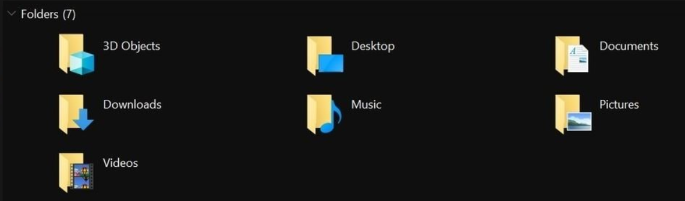

## fix_windows_file_explorer
---
Removes the bloat from file explorer.

  [](https://github.com/cccaaannn/fix_windows_file_explorer/blob/master/LICENSE)


## Remember this trash

</br>
</br>


### Run the binary to remove the trash (windows security detects this as virus since it edits registry)
```shell
fix_windows_file_explorer.exe
```
</br>

### Or run this on a administrator command prompt
```shell
python fix_windows_file_explorer.py
```
</br>

### If you want your trash back
```shell
fix_windows_file_explorer.exe -o create
```
or

```shell
python fix_windows_file_explorer.py -o create
```

---
</br>

You can also edit keys.cfg if you want to keep some of them.


